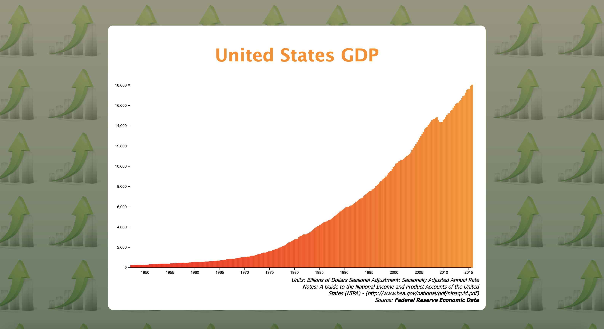
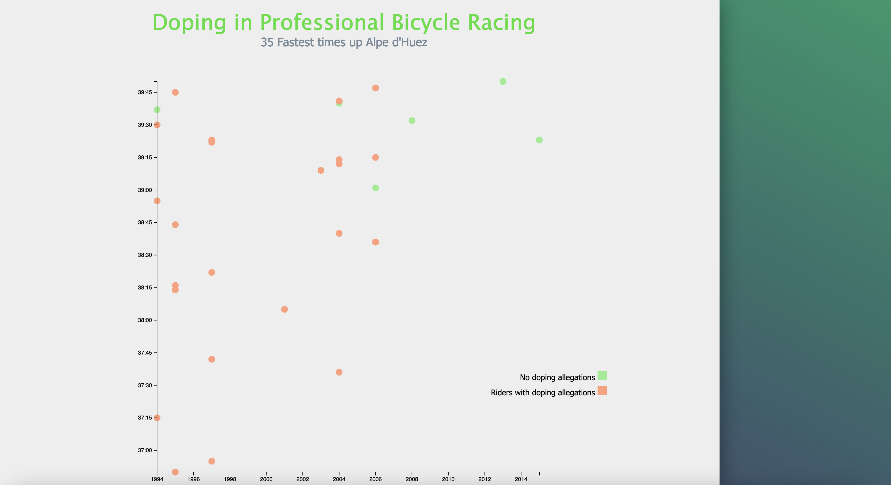

# freecodecamp.org certification projects 🔨

Repository containing my projects required for various freecodecamp certificates

## Data Visualization in D3

Projects created for Data Visualization certificate. [D3.js](https://d3js.org/) was main library used to constuct those SVG graphs, plots and maps. 

### Bar Chart

Live example on [CodePen](https://codepen.io/philip-bjern/pen/YzBjxpo)

### Scatterplot Graph

Live example on [CodePen](https://codepen.io/philip-bjern/pen/KKJBZpa)

### Heatmap

Heat map showing historical data (from 1753 up to 2015) of monthy global land-surface temperature variance

Live example on [CodePen](https://codepen.io/philip-bjern/pen/rNPZadv)

### Choropleth Map

A map showing percentage of adults age 25 and older with bachelor's degree or higher (2010 - 2014) for each county of each state of United States of America

Live example on [CodePen](https://codepen.io/philip-bjern/pen/WNPaOvg)